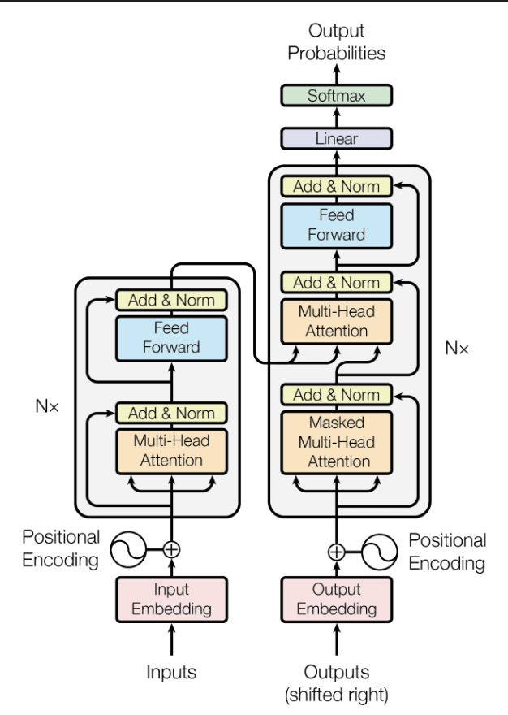
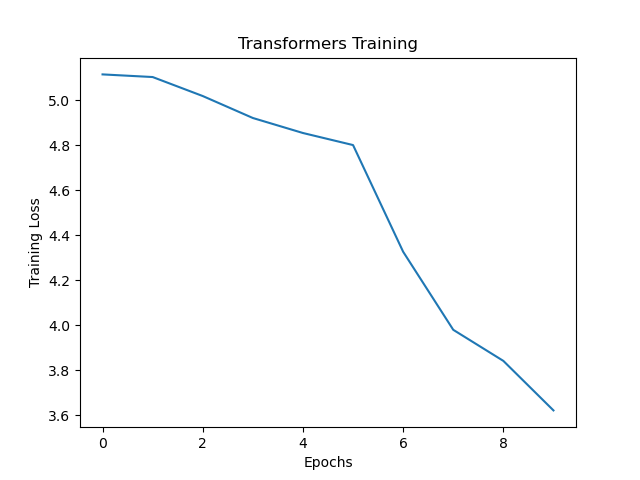

# Transformers From Scratch

## Purpose of this repository:
Implemented custom Transformers-based deep learning architecture for English to Italian translation in Python.

## Architecture

## Training Loss

## Logs

    Epoch: 0
    Training Loss: 5.11556

    SOURCE: It turns out that the happy couple are a Titular Councillor [A modest rank in the Civil Service.] and a Titular Councilloress!
    TARGET: Viene in chiaro che si tratta di una coppia felice: un consigliere titolare e una consiglieressa titolare.
    PREDICTED: godono godono godono godono godono godono godono godono godono strisciando strisciando strisciando strisciando strisciando strisciando strisciando strisciando circostante circostante godono godono godono godono godono godono godono godono godono godono strisciando strisciando strisciando cranio strisciando cranio godono godono godono godono circostante circostante circostante circostante circostante circostante circostante circostante circostante circostante circostante matrimoniale matrimoniale strisciando strisciando strisciando circostante circostante circostante circostante cranio strisciando circostante matrimoniale circostante circostante cranio cranio cranio strisciando cranio strisciando strisciando circostante circostante circostante circostante strisciando strisciando strisciando strisciando strisciando circostante strisciando strisciando strisciando cranio strisciando cranio cranio cranio cranio cranio cranio cranio cranio cranio cranio cranio cranio cranio circostante godono godono circostante circostante circostante circostante circostante circostante circostante circostante circostante circostante circostante circostante circostante matrimoniale metà circostante circostante metà metà metà cranio metà cranio metà cranio cranio cranio circostante circostante circostante matrimoniale circostante origine godono godono cranio strisciando metà origine godono godono godono godono godono circostante circostante circostante circostante circostante godono cranio strisciando metà cranio venirle circostante circostante godono godono godono godono godono godono godono godono godono godono cranio cranio cranio cranio cranio cranio strisciando strisciando strisciando strisciando strisciando strisciando cranio strisciando cranio cranio cranio cranio cranio cranio cranio cranio strisciando cranio strisciando cranio cranio circostante circostante circostante circostante cranio strisciando cranio strisciando cranio strisciando strisciando strisciando cranio strisciando cranio cranio cranio cranio cranio cranio cranio strisciando staio staio staio staio staio staio staio cranio strisciando staio staio staio matrimoniale metà cranio strisciando cranio staio staio godono staio strisciando strisciando strisciando staio staio staio staio staio staio staio staio staio staio staio staio staio staio staio staio staio staio staio staio staio staio staio staio staio staio staio staio staio staio staio staio staio staio staio staio staio staio staio staio staio staio staio staio staio staio staio inseguivano cranio cranio cranio cranio cranio godono godono godono cranio cranio cranio cranio strisciando venirle staio godono staio cranio cranio cranio cranio cranio ?» staio staio staio godono godono godono staio staio staio staio staio staio staio staio staio staio staio staio staio staio staio staio staio staio staio staio staio staio staio staio staio godono godono godono godono
----------
    Epoch: 1
    Training Loss: 5.10382
 
    SOURCE: His face brightened.
    TARGET: Il viso di lui s’illuminò.
    PREDICTED: godono godono godono godono godono consigliò consigliò consigliò consigliò circostante consigliò circostante consigliò consigliò consigliò circostante consigliò circostante circostante circostante matrimoniale consigliò circostante consigliò circostante condur condur condur condur matrimoniale circostante matrimoniale condur condur condur condur condur condur condur condur condur condur circostante matrimoniale circostante matrimoniale matrimoniale matrimoniale matrimoniale matrimoniale matrimoniale matrimoniale matrimoniale matrimoniale matrimoniale matrimoniale matrimoniale matrimoniale matrimoniale matrimoniale matrimoniale matrimoniale matrimoniale matrimoniale matrimoniale matrimoniale matrimoniale matrimoniale condur condur condur matrimoniale matrimoniale matrimoniale matrimoniale matrimoniale matrimoniale matrimoniale matrimoniale matrimoniale matrimoniale matrimoniale matrimoniale matrimoniale matrimoniale matrimoniale matrimoniale matrimoniale matrimoniale matrimoniale matrimoniale matrimoniale matrimoniale matrimoniale matrimoniale matrimoniale matrimoniale matrimoniale matrimoniale matrimoniale matrimoniale matrimoniale matrimoniale matrimoniale matrimoniale matrimoniale matrimoniale matrimoniale matrimoniale matrimoniale matrimoniale matrimoniale matrimoniale matrimoniale matrimoniale matrimoniale matrimoniale matrimoniale matrimoniale matrimoniale metà metà metà metà matrimoniale matrimoniale matrimoniale matrimoniale metà matrimoniale matrimoniale matrimoniale matrimoniale matrimoniale matrimoniale matrimoniale matrimoniale matrimoniale matrimoniale matrimoniale matrimoniale metà matrimoniale metà matrimoniale matrimoniale matrimoniale matrimoniale circostante matrimoniale condur condur condur condur condur condur matrimoniale metà matrimoniale metà metà metà metà matrimoniale matrimoniale matrimoniale condur condur condur condur matrimoniale metà metà matrimoniale matrimoniale matrimoniale matrimoniale matrimoniale matrimoniale matrimoniale metà metà metà matrimoniale metà matrimoniale metà matrimoniale matrimoniale matrimoniale matrimoniale matrimoniale metà matrimoniale metà matrimoniale matrimoniale matrimoniale matrimoniale matrimoniale matrimoniale matrimoniale matrimoniale matrimoniale matrimoniale metà condur condur condur matrimoniale matrimoniale matrimoniale matrimoniale matrimoniale matrimoniale matrimoniale matrimoniale matrimoniale matrimoniale matrimoniale matrimoniale matrimoniale matrimoniale matrimoniale matrimoniale matrimoniale matrimoniale matrimoniale matrimoniale matrimoniale matrimoniale matrimoniale matrimoniale metà metà metà metà metà metà matrimoniale metà matrimoniale metà matrimoniale metà metà metà metà metà metà fenomeno fenomeno fenomeno metà metà metà metà metà matrimoniale fenomeno matrimoniale matrimoniale matrimoniale matrimoniale fenomeno fenomeno matrimoniale metà condur matrimoniale matrimoniale metà metà metà metà metà metà metà metà metà matrimoniale matrimoniale matrimoniale matrimoniale matrimoniale matrimoniale matrimoniale matrimoniale matrimoniale matrimoniale metà metà metà metà metà matrimoniale matrimoniale matrimoniale matrimoniale matrimoniale matrimoniale metà condur matrimoniale metà condur condur condur condur toppe toppe toppe toppe matrimoniale metà condur condur condur condur matrimoniale metà matrimoniale metà metà metà metà metà metà martedì metà toppe rivolgersi metà metà metà metà metà metà metà martedì metà martedì metà metà metà metà metà metà metà
----------
    Epoch: 2
    Training Loss: 5.01932
    
    SOURCE: 'Yes, but you can't but wish to say good-bye to a man who tried to shoot himself for your sake...'
    TARGET: — Già, ma voi non potete non desiderare di perdonare a un uomo che si è sparato per voi....
    PREDICTED: — Non vi è che non vi è che non vi , ma che non è un ’ altra .
----------
    Epoch: 3
    Training Loss: 4.92165

    SOURCE: And bring back an answer at once,' she told the man..
    TARGET: E porta immediatamente la risposta — disse all’inserviente.
    PREDICTED: E che non è un ’ altra , ma che non è un ’ altra .
----------
    Epoch: 4
    Training Loss: 4.85489

    SOURCE: "Yes, sir."
    TARGET: — Sì, signore.
    PREDICTED: — Sì , signore .
----------
    Epoch: 5
    Training Loss: 4.80123
 
    SOURCE: There must be none of this sort of thing.
    TARGET: Che questo non accada più.
    PREDICTED: Non si , non si .
----------
    Epoch: 6
    Training Loss: 4.32670
 
    SOURCE: The Prince raised his hat and went away with his daughter. 'Oh, oh!' he sighed deeply. 'What poor things!'
    TARGET: — Oh, oh — sospirò penosamente; — oh, che disgraziati!
    PREDICTED: Il principe si voltò a guardare il braccio e si voltò a guardare : — Che cosa c ’ è ? — disse , indicando il principe .
----------
    Epoch: 7
    Training Loss: 3.97954

    SOURCE: Thus lodged, I was not, at least--at the commencement of the night, cold.
    TARGET: Così mi accomodai, e da principio non ebbi freddo.
    PREDICTED: Non potevo , non potevo , e la notte .
----------
    Epoch: 8
    Training Loss: 3.84129

    SOURCE: Their conversation was interrupted by Anna, who had found the men in the billiard-room and brought them back with her to the verandah.
    TARGET: La loro conversazione fu interrotta da Anna, che aveva trovato la compagnia degli uomini nella stanza del biliardo e ritornava insieme con loro sulla terrazza.
    PREDICTED: La conversazione era di Anna , che aveva già già già già già in casa e due , si accostò a loro .
----------
    Epoch: 9
    Training Loss: 3.62109
 
    SOURCE: And now?
    TARGET: E ora?
    PREDICTED: E allora ?
----------
